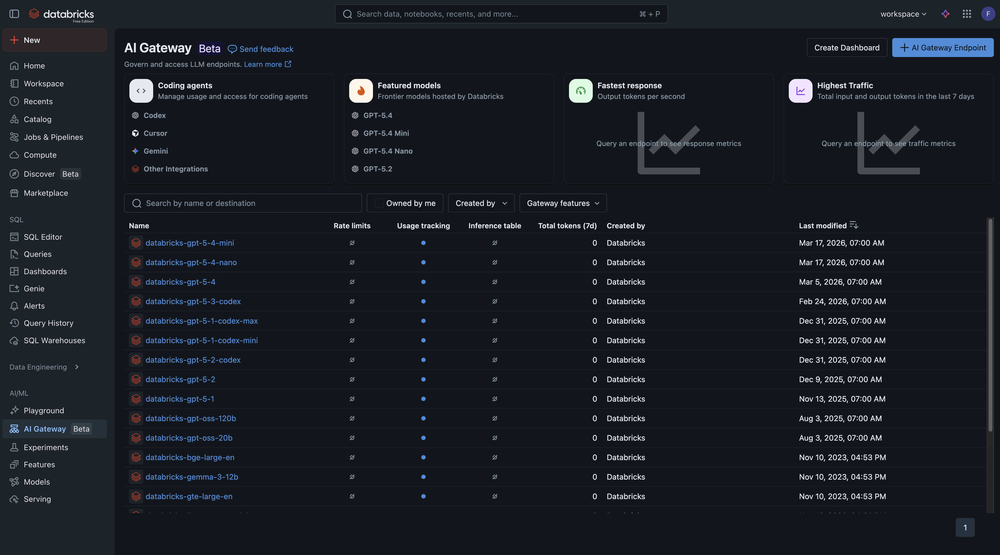
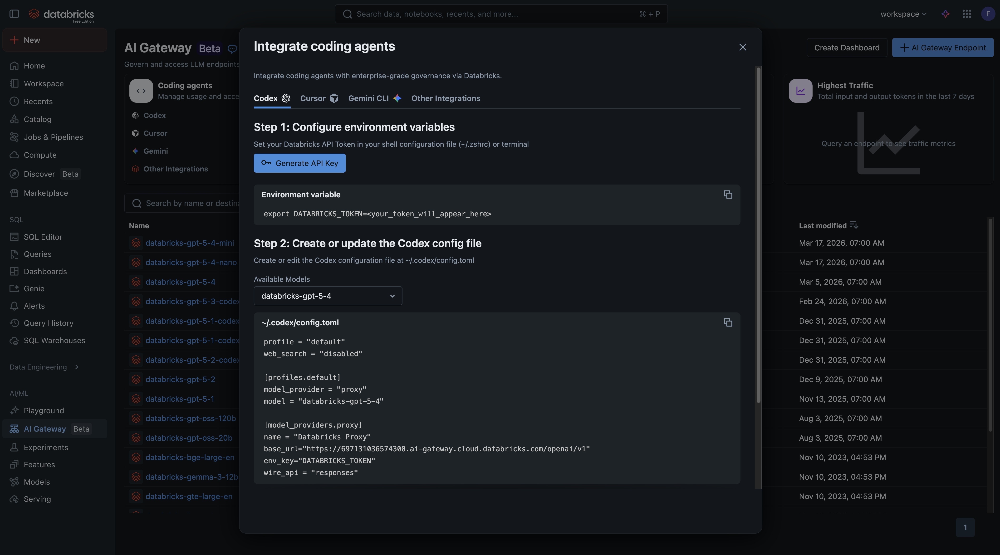

# Vibe Data Engineering Workshop with Databricks (Codex CLI)

Welcome to the **Vibe Data Engineering Workshop**! In this hands-on tutorial, you'll use **Codex CLI** (an AI-powered coding agent by OpenAI) together with **Databricks** to build a complete data pipeline — from raw CSV ingestion to curated gold-layer tables, Genie spaces, and dashboards — all driven by natural language prompts.

> **What is Vibe Data Engineering?** It's the practice of using AI coding agents to build and manage data pipelines through conversational prompts instead of writing every line of code manually. You describe *what* you want, and the AI helps you build it.

### Choose Your Coding Agent

| Coding Agent | Provider | Guide |
|-------------|----------|-------|
| **Claude Code** | Anthropic | [**Go to Claude Code setup**](README.md) |
| **Codex CLI** | OpenAI | You are here |
| **Cursor** | Anysphere | [**Go to Cursor setup**](README_CURSOR.md) |

---

## Table of Contents

1. [Prerequisites](#1-prerequisites)
2. [Repository Overview](#2-repository-overview)
3. [Setting Up Codex CLI](#3-setting-up-codex-cli)
4. [Connecting Codex CLI to Databricks AI Gateway](#4-connecting-codex-cli-to-databricks-ai-gateway)
5. [Choose Your Tutorial](#5-choose-your-tutorial)

---

## 1. Prerequisites

Before you begin, make sure you have:
- Access to a **Databricks workspace** ([sign up for a free trial](https://www.databricks.com/try-databricks) if you don't have one)
- **Git** installed on your machine
- **Node.js 18+** installed ([nodejs.org](https://nodejs.org/)) — required for Codex CLI
- **Homebrew** (macOS) or **winget** (Windows) — for package installs

> If you don't have workspace access yet, contact your workshop facilitator before proceeding.

### One-Command Setup

The installer will handle everything: Codex CLI, Databricks CLI, CLI profile configuration, repo cloning, and AI Dev Kit installation.

**macOS / Linux:**
```bash
bash <(curl -sL https://raw.githubusercontent.com/muharandy-db/dbxf_vibe_de/main/install.sh)
```

**Windows (PowerShell):**
```powershell
irm https://raw.githubusercontent.com/muharandy-db/dbxf_vibe_de/main/install.ps1 | iex
```

When prompted, select **Codex CLI** as your coding agent.

The script will walk you through each step interactively. Once complete, you'll be inside the `dbxf_vibe_de` directory with everything configured.

<details>
<summary><strong>What does the installer do?</strong></summary>

1. Installs **Codex CLI** (via npm)
2. Installs **Databricks CLI** (via Homebrew, winget, or curl)
3. Configures a Databricks CLI profile called `WORKSHOP` (prompts for workspace URL and authenticates via browser)
4. Clones this repository
5. Installs the **Databricks AI Dev Kit** (MCP server + skills for your coding agent)
6. Verifies everything is working

</details>

<details>
<summary><strong>Prefer to install manually?</strong></summary>

If you'd rather set things up step by step:

1. Install Codex CLI: `npm install -g @openai/codex`
2. Install Databricks CLI: `brew install databricks` (macOS) / `winget install Databricks.DatabricksCLI` (Windows)
3. Configure profile: `databricks auth login --profile WORKSHOP`
4. Clone repo: `git clone https://github.com/muharandy-db/dbxf_vibe_de.git && cd dbxf_vibe_de`
5. Install AI Dev Kit: `bash <(curl -sL https://raw.githubusercontent.com/databricks-solutions/ai-dev-kit/main/install.sh)`

</details>

### Checklist

Before moving on, confirm:

- [ ] `codex --version` returns a version number
- [ ] `databricks --version` returns a version number
- [ ] `databricks workspace list / --profile WORKSHOP` returns workspace contents
- [ ] You are in the `dbxf_vibe_de` directory
- [ ] `.codex/` directory exists in the project root

---

## 2. Repository Overview

This workshop repository contains sample data for two industries. Browse the `data/` directory:

```
data/
├── fsi/                          # Financial Services Industry
│   ├── banking_accounts/
│   │   └── banking_accounts.csv
│   ├── banking_branches/
│   │   └── banking_branches.csv
│   ├── banking_customers/
│   │   └── banking_customers.csv
│   ├── banking_transactions/
│   │   └── banking_transactions.csv
│   ├── insurance_claims/
│   │   └── insurance_claims.csv
│   ├── insurance_customers/
│   │   └── insurance_customers.csv
│   └── insurance_policies/
│       └── insurance_policies.csv
│
└── pharma/                       # Pharmaceutical Industry
    ├── distribution_cold_chains/
    │   └── distribution_cold_chains.csv
    ├── distribution_warehouses/
    │   └── distribution_warehouses.csv
    ├── manufacturing_batches/
    │   └── manufacturing_batches.csv
    ├── manufacturing_quality/
    │   └── manufacturing_quality.csv
    ├── retail_inventory/
    │   └── retail_inventory.csv
    ├── retail_outlets/
    │   └── retail_outlets.csv
    ├── retail_sales/
    │   └── retail_sales.csv
    ├── supply_materials/
    │   └── supply_materials.csv
    └── supply_suppliers/
        └── supply_suppliers.csv
```

Each CSV file contains between 150 and 10,000 realistic sample records. Pick an industry to work with for the rest of the workshop — **FSI** or **Pharma**.

---

## 3. Setting Up Codex CLI

Once Codex CLI and the AI Dev Kit are installed, open a terminal and navigate to this repository:

```bash
cd /path/to/dbxf_vibe_de
```

Launch Codex CLI:
```bash
codex
```

On first launch, Codex CLI will prompt you to authenticate with your OpenAI API key. Follow the on-screen instructions to sign in. The AI Dev Kit installer has already configured the Databricks MCP server and skills for this project.

---

## 4. Connecting Codex CLI to Databricks AI Gateway

Databricks **AI Gateway** allows you to route AI model requests through your Databricks workspace, giving you centralized governance, observability, and cost management for all your AI coding tools.

> **Why use AI Gateway?** Instead of each developer using their own OpenAI API key, AI Gateway routes all requests through Databricks — giving you unified billing, usage monitoring, and governance across all coding tools.

### Step 1: Open AI Gateway in Your Workspace

1. Log in to your **Databricks workspace**
2. In the left sidebar, click on **AI Gateway**
3. Click **Coding agents** tab — you'll see the available integrations including Codex CLI



### Step 2: Configure Codex CLI and Generate API Key

1. Select **Codex CLI** as your coding integration
2. Click **Generate API Key** to create your Databricks token
3. The UI will show you the environment variable setup and the full `config.toml` configuration



### Step 3: Configure Codex CLI

First, set the Databricks token as an environment variable:

```bash
export DATABRICKS_TOKEN=<your_databricks_pat_token>
```

> **Tip:** Add this to your shell profile (`~/.bashrc`, `~/.zshrc`, etc.) so it persists across sessions.

Then create or update the Codex CLI configuration file at `~/.codex/config.toml`:

```toml
profile = "default"

[profiles.default]
model_provider = "proxy"
model = "databricks-gpt-5-2"

[model_providers.proxy]
name = "Databricks Proxy"
base_url = "https://<your-ai-gateway-url>/openai/v1"
env_key = "DATABRICKS_TOKEN"
wire_api = "responses"
```

Replace:
- `<your-ai-gateway-url>` with the AI Gateway URL shown in Step 2 (e.g., `https://7474644321313099.ai-gateway.cloud.databricks.com`)
- `<your_databricks_pat_token>` with the API key generated in Step 2

### Step 4: Verify the Connection

Restart Codex CLI and try a simple prompt:
```
Hello, can you confirm you're connected?
```

If you get a response, you're all set! You can also check the **AI Gateway dashboard** in your workspace to see the request appear in the usage metrics.

### Observability

Once connected, go back to **AI Gateway** in your workspace and click **View dashboard** to monitor:
- Request volume and latency
- Token usage and cost
- Per-user activity across all connected coding tools

---

## 5. Choose Your Tutorial

Pick an industry and follow the step-by-step tutorial. Each tutorial contains 8 exercises that guide you through building a complete data pipeline using your coding assistant.

| Tutorial | Description | Exercises |
|----------|-------------|-----------|
| [**FSI (Financial Services)**](TUTORIAL_FSI.md) | Banking customers, accounts, transactions, insurance policies, and claims | 8 exercises |
| [**Pharma (Pharmaceutical)**](TUTORIAL_PHARMA.md) | Manufacturing batches, quality control, cold chain distribution, retail sales, and supply chain | 8 exercises |

Both tutorials follow the same structure:

1. Create a schema
2. Create a landing volume
3. Upload sample data
4. Build the bronze layer (raw ingestion)
5. Build the silver layer (data quality)
6. Build the gold layer (business aggregations — one table at a time)
7. Validate and run the pipeline
8. Create Genie spaces and dashboards

---

> **Workshop guide for Codex CLI** — by OpenAI
>
> For other coding agents, see [Claude Code](README.md) or [Cursor](README_CURSOR.md).
> For questions or feedback, reach out to your workshop facilitator.
